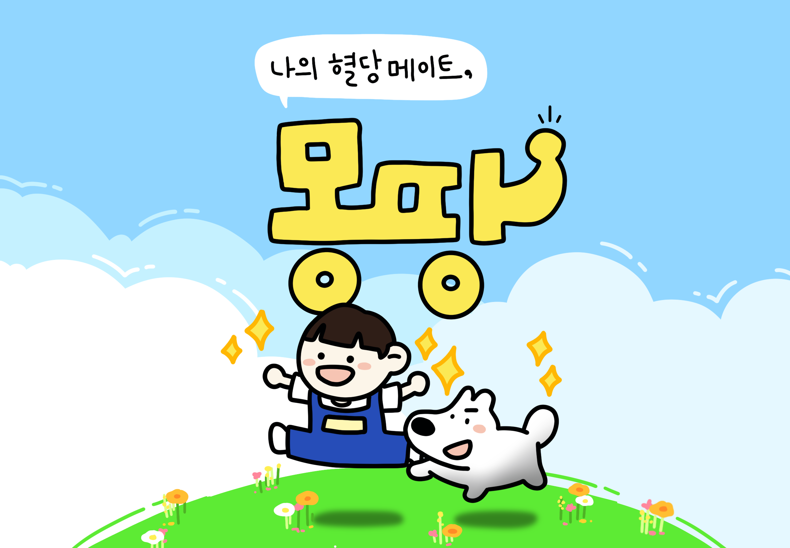

# ✨나의 혈당 메이트, 몽땅(MongDDang)✨

---

### 1️⃣ 프로젝트 개요

✨ **개발 기간**

| 개발기간 | 2024.10.14 ~ 2024.11.19 (6주) |
| -------- | ----------------------------- |

✨ **팀원 소개**

| 팀원   | 역할                                                                                                     |
| ------ | -------------------------------------------------------------------------------------------------------- |
| 김민진 | 팀장, FE, UI/UX 디자인, 기능개발(메인페이지, 알림, 약관리, 일일 퀘슽, 식사, 수면, 운동 등록 및 수정)     |
| 권대호 | FE, Infra(CI/CD), 기능 구현(회원관리(로그인, 어린이 보호자 연결), 어린이/보호자 화면 기록, 일일 기록)    |
| 조선미 | FE, 디자인 컴포넌트 개발, 기능구현(회원관리(회원가입, 프로필), 도감, 업적, 주간리포트), 갤럭시 워치 기능 |
| 나혜림 | 안드로이드, FE, BE, 크롤링                                                                               |
| 변서원 | BE, 기능구현, 에셋 디자인                                                                                |
| 유영한 | FE, BE, 기능 구현                                                                                        |

✨ **기획 의도**

| 1형 당뇨, 4년 사이 `26%` 증가                                                                                        |
| -------------------------------------------------------------------------------------------------------------------- |
| 소아 1형 당뇨의 경우 습관 형성이 필요하지만, 심리적으로 취약하기도 하고 실시간 혈당이 보호자와 연결의 필요성이 있음  |
| 갤럭시 워치를 활용하여 실시간 혈당을 공유하고 앱을 통해 아이 뿐 아니라 보호자도 함께 공유할 수 있는 앱을 만들기 위함 |

✨ **목표**

아이들의 혈당 관리 습관을 만들고 보호자의 불안감 해소

---

### 2️⃣ 서비스 기능 소개

✨ **워치**

- 실시간 혈당 알림

✨ **스마트폰**

- 혈당관리와 관련한 퀘스트 제공

- 코인과 캐릭터로 보상 지급, 동기 부여

- 피보호자의 습관형성 상태 확인

- 피보호자의 혈당 리포트 제공

- 응급상황 실시간 알림

---

### 3️⃣ Figma

## 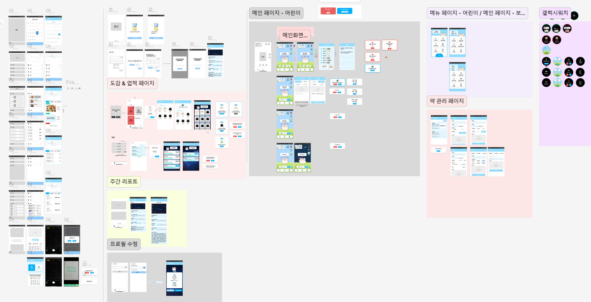

### 3️⃣ ERD

## 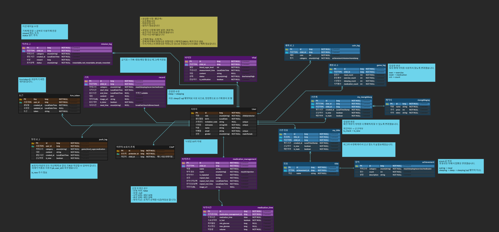

### 4️⃣ 기술 스택

## 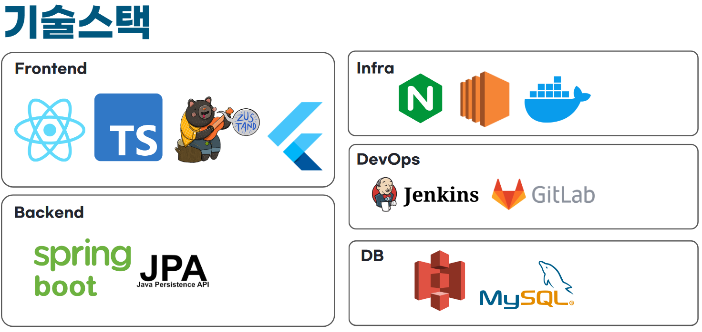

### 5️⃣ 아키텍처

## 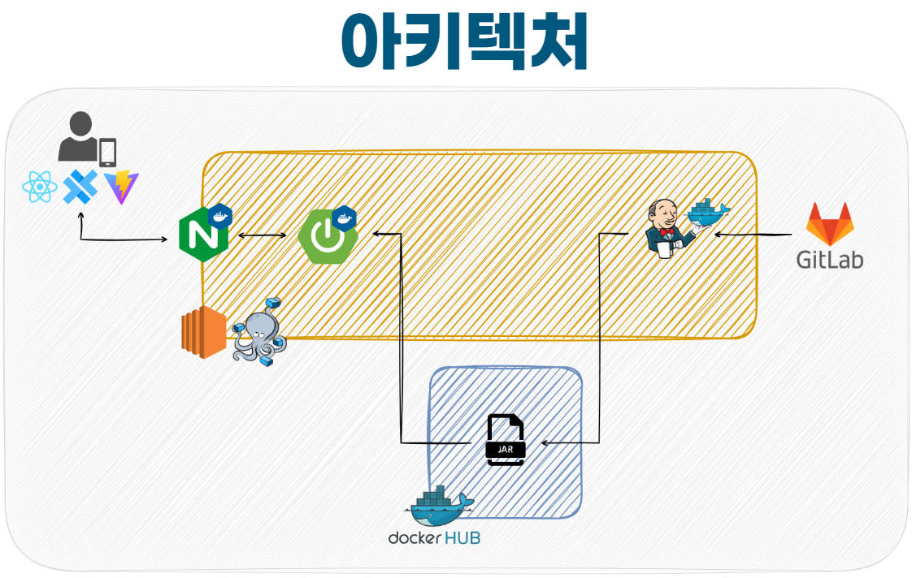

### 6️⃣ 기대효과

- 몽땅과의 대화로 인한 어린이 정서적 안정

- 이상 혈당에 대한 빠른 대처 가능

- 갤럭시 워치 활용성 증대

- 보호자 불안 해소 및 부담 경감

- 게임화 된 건강관리로 인한 지속적 습관 형성

---

### API

##### User

## 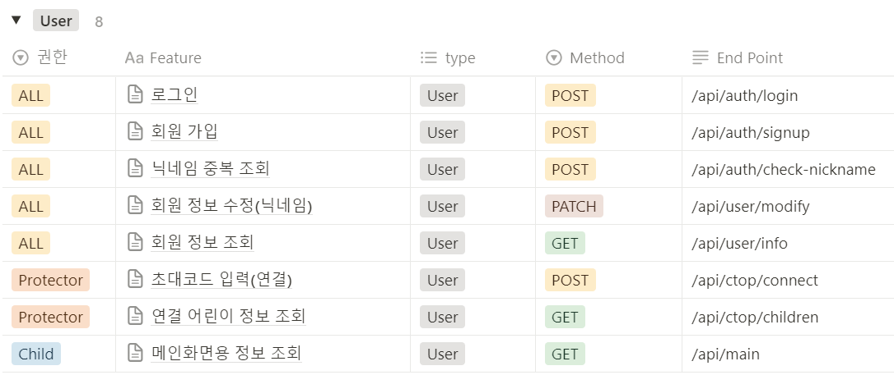

##### FCM

## 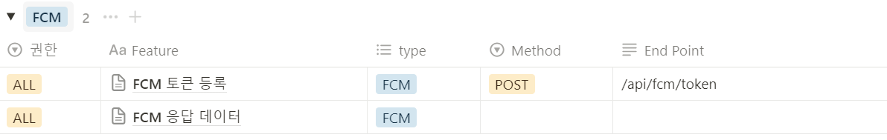

##### Notificatioin

## 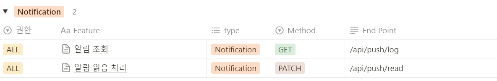

##### Game

## 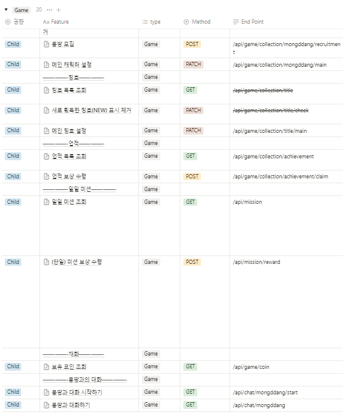

##### Record

## 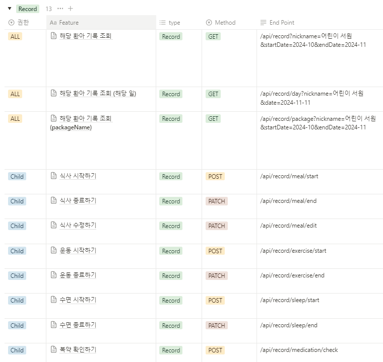

##### Medication

## 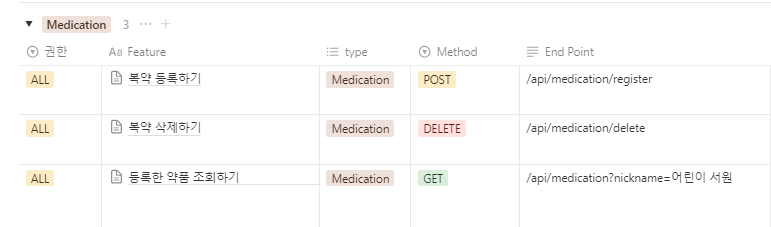

##### vital

## 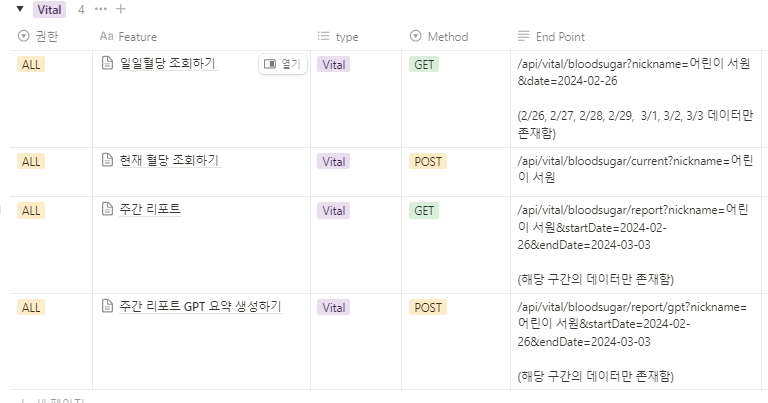
